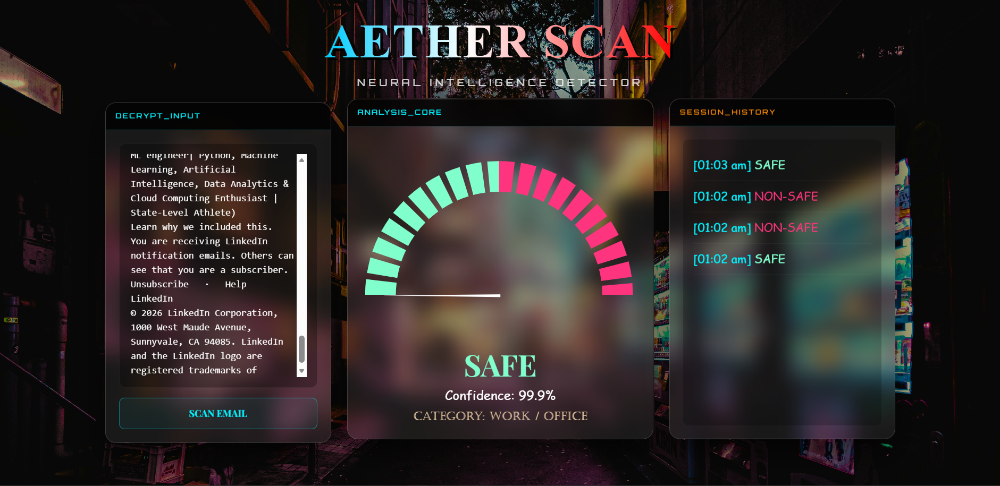
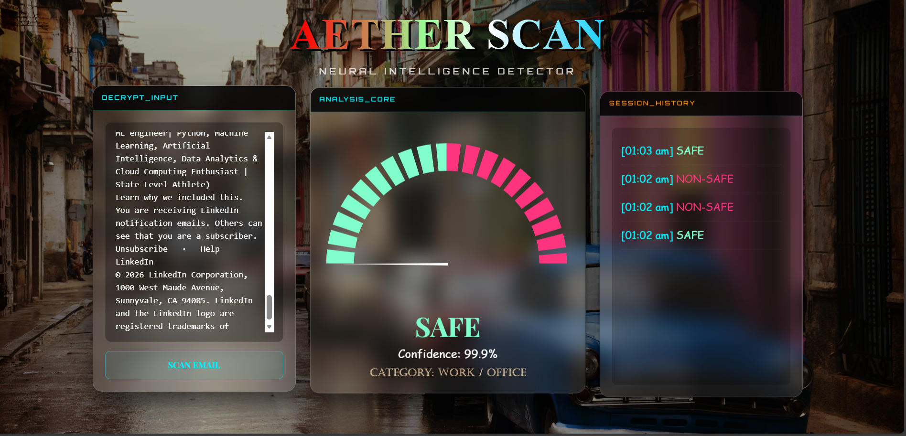

# 📧 AETHER SCAN
### AI-Powered Email Security & Classification System
**Developed for the IBM Tecnovate Program / IBM Internship**

---

## 📖 Project Overview
**AETHER SCAN** is an intelligent Email Classification & Security Detection System built using **Django** and **BERT**. It analyzes email content to determine whether an email is **SAFE** or **NON-SAFE** and identifies categories such as phishing, promotional emails, scams, fraud attempts, or security alerts.

The system combines **deep learning (BERT)** with **rule-based classification** to provide a reliable email security detection mechanism through an interactive web interface.

---

## 🎥 Project Presentation
📊 **Presentation Slides**

https://1drv.ms/p/c/2034eba96d41ae6d/IQDLALWWZXjTR54-qwvPGL7TASylUsqkiKegLfYbBQpyslQ?e=tqYv6h

---

## 🚀 Key Features
* **AI-Powered Classification** using a fine-tuned **BERT model**
* **Security Detection** for SAFE and NON-SAFE emails
* **Email Category Identification** (phishing, scam, promotional, etc.)
* **Modern Glassmorphism UI** with dynamic animations
* **Confidence Score Gauge Visualization**
* **Session-Based Email History Tracking**

---

## 📸 Application Screenshots

### User Interface



### Email Analysis Result



---

## 📂 Email Categories Supported

- Phishing  
- Promotional  
- Scam / Fraud  
- Security Alert  
- General / Safe Communication  

---

## 🛠 Tech Stack

**Backend**
- Django (Python)

**Machine Learning**
- BERT (Fine-Tuned)
- PyTorch
- HuggingFace Transformers

**Frontend**
- HTML5
- CSS3
- JavaScript
- Bootstrap

**Deployment**
- WhiteNoise for static files

---

## 📂 Project Structure

```text
email_classifier/
│
├── classifier/              # Core Django app logic
│   ├── views.py
│   ├── urls.py
│
├── email_classifier/        # Django project configuration
│
├── model/                   # BERT model directory (not included in repo)
│
├── static/
│   └── screenshots/
│       ├── UI_INTERFACE1.PNG
│       └── UI-INTERFACE2.PNG
│
├── templates/
│   └── index.html
│
├── manage.py
├── db.sqlite3
└── README.md
```

---

## 🤖 Model Handling (Important)

The trained **BERT model is not included in this GitHub repository** to avoid large file issues.

### Download Model

https://drive.google.com/file/d/1MxN9aEQr9QUmCy1cxAbTCNaPnvIH4ptx/view?usp=drive_link

---

### After Downloading

Extract the ZIP and place it inside:

```
email_classifier/model/
```

Expected structure:

```text
model/
└── phishing_bert_final/
    ├── config.json
    ├── pytorch_model.bin
    ├── tokenizer.json
    └── vocab.txt
```

---

## ⚙️ Installation & Setup

### Clone Repository

```bash
git clone <your-repository-url>
cd email_classifier
```

### Create Virtual Environment

```bash
python -m venv venv
```

### Activate Environment

**Windows**

```bash
venv\Scripts\activate
```

**Mac / Linux**

```bash
source venv/bin/activate
```

### Install Dependencies

```bash
pip install django torch transformers whitenoise
```

### Run Migrations

```bash
python manage.py migrate
```

### Run Server

```bash
python manage.py runserver
```

Open in browser:

```
http://127.0.0.1:8000/
```

---

## ⚡ How It Works

1. User enters email text  
2. BERT tokenizer processes the text  
3. Fine-tuned BERT predicts **SAFE / NON-SAFE**  
4. Confidence score is generated  
5. Rule-based logic assigns email category  
6. UI updates with prediction, category, gauge meter, and history

---

## 🔮 Future Scope

- Multi-class deep learning classification
- **OCR-based email attachment scanning**
- **Explainable AI for model transparency**
- Integration with **real email clients**
- Cloud deployment
- Mobile application support

---

## 👩‍💻 Project Contributor

**Khushi Singh**  
B.Tech Computer Science (AI & ML)  
AKS University, Satna  

**Program:** IBM Tecnovate Internship

---

⭐ If you find this project useful, consider giving it a **star on GitHub**.
